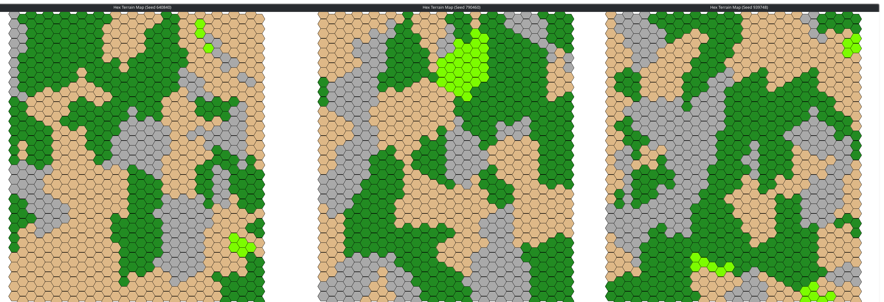

## Unnamed Farm Game

A simple hex-tile based farm and city builder game created for [Amaiguri's June 2025 Atelier Workshop](https://itch.io/jam/amaiguris-april-2024-atelier-workshop).

### Overview

Build farms, mines, and houses to manage your population, food, and gold. Balance your resources and expand your town.

### Game Design Document

See the full [Game Design Document](game_design_doc.md) for details.

### Requirements

- [Python 3.13](https://www.python.org/downloads/release/python-3130/)

### Running the Game

1. Download the Source

```bash
git clone https://github.com/canHazUsername/Farm_Game.git
cd Farm_game
```

2. Create Virtual Environment

**Windows**

```bash
python -m venv venv
.\venv\Scripts\activate.ps1
```

**Linux/Mac**

```bash
python -m venv venv
source ./venv/bin/activate
```

3. Install Requirements

```bash
pip install -r requirements.txt
```

4. Run the Game

```bash
python game.py
```

### Map Generation

You can generate a map directly from `map_gen/map_gen.py`, which can be run as a standalone application


